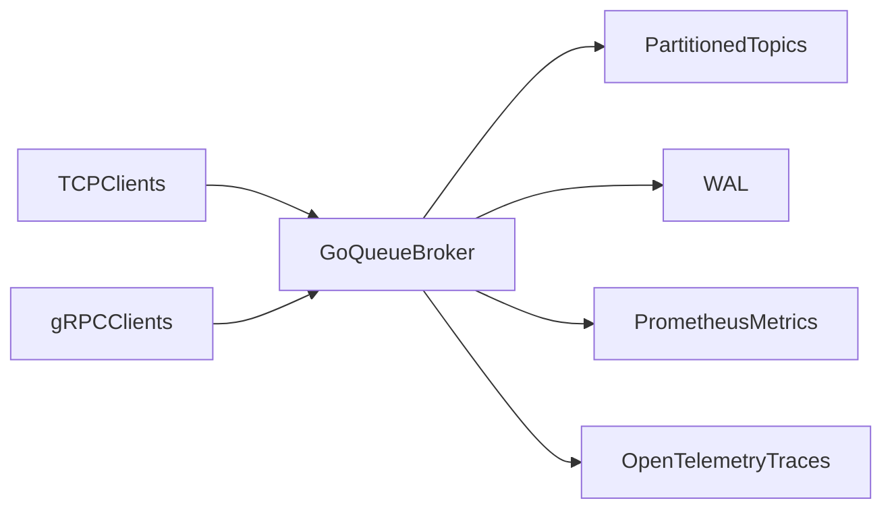

# GoQueue

A compact, partitioned message broker in Go focused on one practical question:

**How do you run multi-agent AI event streams with stable ordering, replay, and incident-level observability without heavyweight broker operations?**

---

## Problem We Solve

Multi-agent systems generate bursty streams: token chunks, tool calls, retries, and handoff events.
Teams usually hit one of two bad options:

- lightweight queues that are easy to run but hard to replay and debug
- heavyweight brokers that are powerful but expensive to operate for small-to-mid workloads

`GoQueue` targets this gap with a focused event backbone for AI agent pipelines.

---

## Product Direction (Current Pivot)

`GoQueue` is being developed as a **Session-Ordered Event Bus for AI Agents**:

- keep ordering stable by routing with a session key (`tenant/project/session`)
- keep recovery practical with WAL-backed replay
- keep ops simple with a small Go runtime + Docker Compose stack
- keep incidents debuggable with metrics + traces by default

This is not positioned as a universal Kafka replacement. It is focused on AI-native streaming workloads where low operational overhead matters.

---

## Architecture (Analogy)

### The Brain: Broker
- Holds topic state, partitions, offsets, and routing decisions.
- Implements round-robin, key-based routing, and explicit partition publish.

### The Memory: WAL
- Appends publish records and replays them on restart.
- Stores partition metadata in current WAL records for correct replay routing.

### The Eyes: Metrics and Tracing
- Prometheus for rates/lag/counters.
- OpenTelemetry traces for request-level visibility (especially gRPC flows).

### The Hands: Clients
- `cmd/goqueue` CLI for publish/consume workflows.
- TCP clients for lightweight usage, gRPC clients for typed APIs.



---

## Current Scope (Important)

- `GoQueue` is currently a **single-node broker runtime**.
- Docker Compose can start multiple nodes for local topology/observability demos.
- Raft role/leader/term fields are currently **state labels**, not full consensus replication.

This keeps claims honest while the distributed-v1 track is developed.

---

## Codebase Fit Analysis (Why This Pivot Is Practical)

The current codebase already has the right primitives for an AI-agent event bus:

- partitioned broker routing (`internal/broker`) for per-session ordering
- WAL append/replay (`internal/wal`) for crash recovery
- group offsets (`internal/consumer`) for streaming consumers
- gRPC + TCP clients (`internal/grpcapi`, `internal/cli`) for different integration needs
- metrics/tracing (`internal/metrics`, `internal/telemetry`) for runtime visibility

Current gaps to close for this direction:

- AI-specific queue policies (priority)
- stronger session-level observability (per-session lag/error counters)
- clearer SLO-oriented benchmark scenarios for agent workloads

### Pivot Started (implemented)

- added a standardized agent event envelope in `internal/agentstream`
- added `goqueue publish-agent` command with session-key routing
- added `goqueue retry-agent` command for retry/DLQ routing flow
- added broker-side Prometheus counters for agent events/retries/DLQ on gRPC publish
- preserved existing publish/consume APIs for compatibility

---

## Quick Start

### 1) Run broker
```bash
go run ./cmd/broker --tcp-addr=:9090 --grpc-addr=:9095 --metrics-addr=:2112 --wal-path=data/goqueue.wal
```

### 2) Publish and consume (TCP)
```bash
go run ./cmd/goqueue publish --addr localhost:9090 --topic orders "hello tcp"
go run ./cmd/goqueue consume --addr localhost:9090 --topic orders --group payment-service
```

### 3) Publish and consume (gRPC)
```bash
go run ./cmd/goqueue publish --grpc --addr localhost:9095 --topic orders "hello grpc"
go run ./cmd/goqueue consume --grpc --addr localhost:9095 --topic orders --group payment-service --partition -1
```

### 4) Key-based routing (gRPC)
```bash
go run ./cmd/goqueue publish --grpc --addr localhost:9095 --topic orders --key user-42 "order-a"
go run ./cmd/goqueue publish --grpc --addr localhost:9095 --topic orders --key user-42 "order-b"
```

### 5) Explicit partition publish (gRPC)
```bash
go run ./cmd/goqueue publish --grpc --addr localhost:9095 --topic orders --partition 2 "force-p2"
go run ./cmd/goqueue consume --grpc --addr localhost:9095 --topic orders --group debug --partition 2
```

### 6) Publish AI agent event envelope (session-ordered key)
```bash
go run ./cmd/goqueue publish-agent --grpc --addr localhost:9095 \
  --tenant acme --project support-bot --session sess-42 --agent planner \
  --type tool.call --step retrieve-context --attempt 1 \
  --payload '{"tool":"search","query":"latest order status"}'
```

### 7) Retry or route failed agent event to DLQ
```bash
go run ./cmd/goqueue retry-agent --grpc --addr localhost:9095 \
  --topic agent-events --max-attempts 3 --delay 2s \
  --event '{"version":"v1","type":"tool.call","tenant":"acme","project":"support-bot","session_id":"sess-42","agent_id":"planner","attempt":1,"created_at":"2026-04-03T10:00:00Z","payload":{"tool":"search","query":"latest order status"}}'
```

If `attempt+1 > max-attempts`, the event is routed to `<topic>.dlq` (or `--dlq-topic`).

---

## Go WASM Dashboard (No Docker Required)

If you want the web dashboard built in Go + WebAssembly:

```powershell
$env:GOOS="js"
$env:GOARCH="wasm"
go build -o web/app.wasm ./cmd/dashboard
Remove-Item Env:GOOS
Remove-Item Env:GOARCH
go run ./cmd/dashboard --broker http://localhost:2112 --addr :8080 --wasm-dir web
```

Open: `http://localhost:8080`

---

## Automation (Cross-Platform)

### macOS / Linux (Make)

```bash
make dev
make test
make lint
make up
make down
make clean
```

### Windows (PowerShell)

```powershell
./scripts/goqueue.ps1 dev
./scripts/goqueue.ps1 test
./scripts/goqueue.ps1 lint
./scripts/goqueue.ps1 up
./scripts/goqueue.ps1 down
./scripts/goqueue.ps1 clean
```

You can list available tasks with:

```bash
make help
```

```powershell
./scripts/goqueue.ps1 help
```

---

## Observability Stack (Optional with Docker)

```bash
docker compose up --build
```

Services:
- Grafana: `http://localhost:3000`
- Prometheus: `http://localhost:9099`
- Tempo: `http://localhost:3200`
- Broker metrics: `http://localhost:2112/metrics`
- Broker readiness: `http://localhost:2112/readyz`

Agent-focused metrics (new):
- `goqueue_agent_events_published_total`
- `goqueue_agent_event_retries_total`
- `goqueue_agent_event_dlq_total`

---

## Benchmark Evidence (Local)

Benchmarks are documented and reproducible from `bench/bench_test.go`.

Run:
```bash
GOQUEUE_BENCH=1 go test ./bench -run TestThroughputReport -count=1 -v
GOQUEUE_BENCH=1 go test ./bench -run TestTCPThroughputReport -count=1 -v
GOQUEUE_BENCH=1 go test ./bench -run TestLatencyReport -count=1 -v
```

Reference local numbers (developer machine, 256B payload):
- In-process publish: around `4.3M msgs/sec`
- TCP end-to-end publish (localhost): around `45K msgs/sec`

Treat these as local benchmark evidence, not production SLA claims.

---

## Project Layout

```text
cmd/broker        broker server entrypoint
cmd/goqueue       CLI for publish/consume
cmd/dashboard     dashboard server + wasm build target
internal/broker   routing, topic/partition logic
internal/wal      write-ahead log and replay
internal/agentstream AI event envelope + session key helpers
internal/metrics  Prometheus metrics
internal/telemetry OpenTelemetry setup
proto             gRPC/protobuf contracts
web               Go WASM dashboard source
```

---

## Why This Project

- Models real queue concerns: ordering, replay, lag, and visibility.
- Uses practical interfaces (TCP + gRPC) instead of a toy API only.
- Keeps implementation readable enough for extension and experimentation.
- Provides a clear path to distributed-v1 evolution.
