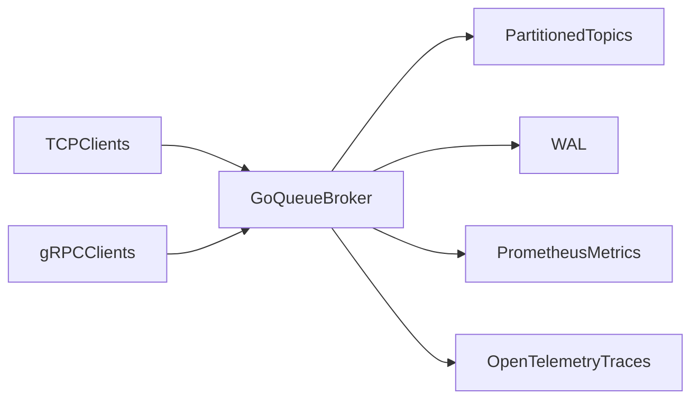

# GoQueue

A compact, partitioned message broker in Go built to answer one practical infrastructure question:

**How do you keep event processing fast and debuggable when many producers and consumers hit the system at once?**

---

## Background

Most queue demos stop at "message in, message out."

Real systems need more:
- stable ordering for related events
- replay after crashes
- visibility into throughput and lag
- APIs that support both simple clients and typed services

`GoQueue` is built as a learning-and-engineering project around those exact problems.

---

## Core Idea

Use a small broker with:
- **partitioned topics** for predictable routing and ordering
- **WAL-backed replay** for crash recovery
- **dual transport** (`TCP` and `gRPC`) for flexibility
- **observability-first design** (Prometheus + OpenTelemetry)

---

## Architecture (Analogy)

### The Brain: Broker
- Holds topic state, partitions, offsets, and routing decisions.
- Implements round-robin, key-based routing, and explicit partition publish.

### The Memory: WAL
- Appends publish records and replays them on restart.
- Stores partition metadata in current WAL records for correct replay routing.

### The Eyes: Metrics and Tracing
- Prometheus for rates/lag/counters.
- OpenTelemetry traces for request-level visibility (especially gRPC flows).

### The Hands: Clients
- `cmd/goqueue` CLI for publish/consume workflows.
- TCP clients for lightweight usage, gRPC clients for typed APIs.



---

## Current Scope (Important)

- `GoQueue` is currently a **single-node broker runtime**.
- Docker Compose can start multiple nodes for local topology/observability demos.
- Raft role/leader/term fields are currently **state labels**, not full consensus replication.

This keeps claims honest while the distributed-v1 track is developed.

---

## Quick Start

### 1) Run broker
```bash
go run ./cmd/broker --tcp-addr=:9090 --grpc-addr=:9095 --metrics-addr=:2112 --wal-path=data/goqueue.wal
```

### 2) Publish and consume (TCP)
```bash
go run ./cmd/goqueue publish --addr localhost:9090 --topic orders "hello tcp"
go run ./cmd/goqueue consume --addr localhost:9090 --topic orders --group payment-service
```

### 3) Publish and consume (gRPC)
```bash
go run ./cmd/goqueue publish --grpc --addr localhost:9095 --topic orders "hello grpc"
go run ./cmd/goqueue consume --grpc --addr localhost:9095 --topic orders --group payment-service --partition -1
```

### 4) Key-based routing (gRPC)
```bash
go run ./cmd/goqueue publish --grpc --addr localhost:9095 --topic orders --key user-42 "order-a"
go run ./cmd/goqueue publish --grpc --addr localhost:9095 --topic orders --key user-42 "order-b"
```

### 5) Explicit partition publish (gRPC)
```bash
go run ./cmd/goqueue publish --grpc --addr localhost:9095 --topic orders --partition 2 "force-p2"
go run ./cmd/goqueue consume --grpc --addr localhost:9095 --topic orders --group debug --partition 2
```

---

## Go WASM Dashboard (No Docker Required)

If you want the web dashboard built in Go + WebAssembly:

```powershell
$env:GOOS="js"
$env:GOARCH="wasm"
go build -o web/app.wasm ./cmd/dashboard
Remove-Item Env:GOOS
Remove-Item Env:GOARCH
go run ./cmd/dashboard --broker http://localhost:2112 --addr :8080 --wasm-dir web
```

Open: `http://localhost:8080`

---

## Observability Stack (Optional with Docker)

```bash
docker compose up --build
```

Services:
- Grafana: `http://localhost:3000`
- Prometheus: `http://localhost:9099`
- Tempo: `http://localhost:3200`
- Broker metrics: `http://localhost:2112/metrics`
- Broker readiness: `http://localhost:2112/readyz`

---

## Benchmark Evidence (Local)

Benchmarks are documented and reproducible from `bench/bench_test.go`.

Run:
```bash
GOQUEUE_BENCH=1 go test ./bench -run TestThroughputReport -count=1 -v
GOQUEUE_BENCH=1 go test ./bench -run TestTCPThroughputReport -count=1 -v
GOQUEUE_BENCH=1 go test ./bench -run TestLatencyReport -count=1 -v
```

Reference local numbers (developer machine, 256B payload):
- In-process publish: around `4.3M msgs/sec`
- TCP end-to-end publish (localhost): around `45K msgs/sec`

Treat these as local benchmark evidence, not production SLA claims.

---

## Project Layout

```text
cmd/broker        broker server entrypoint
cmd/goqueue       CLI for publish/consume
cmd/dashboard     dashboard server + wasm build target
internal/broker   routing, topic/partition logic
internal/wal      write-ahead log and replay
internal/metrics  Prometheus metrics
internal/telemetry OpenTelemetry setup
proto             gRPC/protobuf contracts
web               Go WASM dashboard source
```

---

## Why This Project

- Models real queue concerns: ordering, replay, lag, and visibility.
- Uses practical interfaces (TCP + gRPC) instead of a toy API only.
- Keeps implementation readable enough for extension and experimentation.
- Provides a clear path to distributed-v1 evolution.
