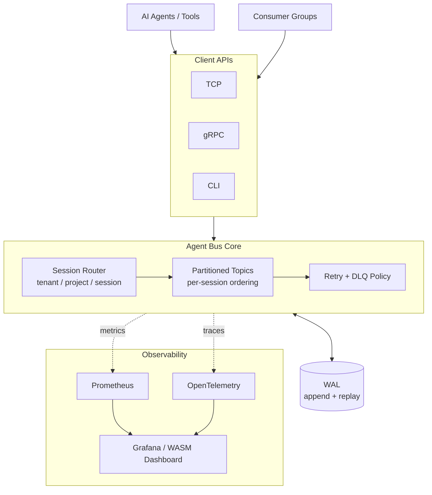

# Agent Bus

A compact, partitioned event bus in Go built around one practical question:

**How do you run multi-agent AI event streams with stable ordering, replay, and incident-level observability without heavyweight broker operations?**

---

## Problem

Multi-agent systems produce bursty streams of token chunks, tool calls, retries, and handoffs. Teams usually pick between two bad options:

- lightweight queues that are easy to run but hard to replay and debug
- heavyweight brokers that are powerful but expensive to operate at small scale

`Agent Bus` targets that gap.

---

## What It Is

`Agent Bus` is a **session-ordered event bus for AI agents**:

- routes by session key (`tenant/project/session`) for stable per-session ordering
- replays from a WAL on restart for crash recovery
- ships with Prometheus and OpenTelemetry by default
- runs as a single Go binary; the Docker Compose stack is optional

It is not a Kafka replacement. It is focused on AI-native streaming where low operational overhead matters.

---

## Architecture



| Layer | Responsibility |
|---|---|
| **Client APIs** | TCP, gRPC, and CLI surfaces for producers and consumers |
| **Session Router** | Picks a partition per `tenant/project/session` to keep ordering stable |
| **Partitioned Topics** | Append-only ring buffers with offset and eviction tracking |
| **Retry + DLQ** | Broker-native policy that auto-routes failed events on max-attempt |
| **WAL** | Append-only durability with full replay on restart |
| **Observability** | Prometheus counters and OpenTelemetry traces, surfaced via Grafana or the built-in WASM dashboard |

---

## Current Scope

- Single-node broker runtime today.
- Docker Compose can spin up multiple nodes for local topology and observability demos.
- `raft-*` fields are state labels for the dashboard, not real consensus replication. The distributed-v1 design lives in [docs/distributed-v1-design.md](docs/distributed-v1-design.md).

---

## Quick Start

### Run the broker

```bash
go run ./cmd/broker --tcp-addr=:9090 --grpc-addr=:9095 --metrics-addr=:2112 --wal-path=data/agentbus.wal
```

### Publish and consume (TCP)

```bash
go run ./cmd/goqueue publish --addr localhost:9090 --topic orders "hello tcp"
go run ./cmd/goqueue consume --addr localhost:9090 --topic orders --group payment-service
```

### Publish and consume (gRPC)

```bash
go run ./cmd/goqueue publish --grpc --addr localhost:9095 --topic orders "hello grpc"
go run ./cmd/goqueue consume --grpc --addr localhost:9095 --topic orders --group payment-service --partition -1
```

### Key-based routing

```bash
go run ./cmd/goqueue publish --grpc --addr localhost:9095 --topic orders --key user-42 "order-a"
go run ./cmd/goqueue publish --grpc --addr localhost:9095 --topic orders --key user-42 "order-b"
```

### Publish an agent event (session-ordered)

```bash
go run ./cmd/goqueue publish-agent --grpc --addr localhost:9095 \
  --tenant acme --project support-bot --session sess-42 --agent planner \
  --type tool.call --step retrieve-context --attempt 1 \
  --payload '{"tool":"search","query":"latest order status"}'
```

### Retry or route a failed agent event to DLQ

```bash
go run ./cmd/goqueue retry-agent --grpc --addr localhost:9095 \
  --topic agent-events --max-attempts 3 --delay 2s \
  --event '{"version":"v1","type":"tool.call","tenant":"acme","project":"support-bot","session_id":"sess-42","agent_id":"planner","attempt":1,"created_at":"2026-04-03T10:00:00Z","payload":{"tool":"search","query":"latest order status"}}'
```

If `attempt + 1 > max-attempts`, the event is routed to `<topic>.dlq` (or `--dlq-topic` if specified).

> The CLI binary is still named `goqueue` in code. A package rename will follow in a separate pass to keep the build clean.

---

## WASM Dashboard

```powershell
$env:GOOS="js"
$env:GOARCH="wasm"
go build -o web/app.wasm ./cmd/dashboard
Remove-Item Env:GOOS
Remove-Item Env:GOARCH
go run ./cmd/dashboard --broker http://localhost:2112 --addr :8080 --wasm-dir web
```

Open `http://localhost:8080`.

---

## Automation

### macOS / Linux

```bash
make dev
make test
make lint
make up
make down
make clean
```

### Windows (PowerShell)

```powershell
./scripts/goqueue.ps1 dev
./scripts/goqueue.ps1 test
./scripts/goqueue.ps1 lint
./scripts/goqueue.ps1 up
./scripts/goqueue.ps1 down
./scripts/goqueue.ps1 clean
```

Use `make help` or `./scripts/goqueue.ps1 help` to list available tasks.

---

## Observability Stack

```bash
docker compose up --build
```

| Service | URL |
|---|---|
| Grafana | `http://localhost:3000` |
| Prometheus | `http://localhost:9099` |
| Tempo | `http://localhost:3200` |
| Broker metrics | `http://localhost:2112/metrics` |
| Broker readiness | `http://localhost:2112/readyz` |

Agent-focused counters:

- `goqueue_agent_events_published_total`
- `goqueue_agent_event_retries_total`
- `goqueue_agent_event_dlq_total`

---

## Benchmark Evidence (Local)

Reproducible from [bench/bench_test.go](bench/bench_test.go).

```bash
GOQUEUE_BENCH=1 go test ./bench -run TestThroughputReport -count=1 -v
GOQUEUE_BENCH=1 go test ./bench -run TestTCPThroughputReport -count=1 -v
GOQUEUE_BENCH=1 go test ./bench -run TestLatencyReport -count=1 -v
GOQUEUE_BENCH=1 go test ./bench -run TestAgentEventThroughputAndMetricsReport -count=1 -v
```

Reference local numbers (developer machine, 256 B payload):

- in-process publish: ~`4.3M msgs/sec`
- TCP localhost end-to-end: ~`45K msgs/sec`

Treat these as local benchmark evidence, not production SLA claims.

---

## Project Layout

```text
cmd/broker            broker server entrypoint
cmd/goqueue           CLI for publish / consume / agent flows
cmd/dashboard         dashboard server + WASM build target
internal/broker       routing, topic, partition logic
internal/wal          write-ahead log and replay
internal/agentstream  AI event envelope + session key + retry policy
internal/grpcapi      gRPC service implementation
internal/metrics      Prometheus metrics
internal/telemetry    OpenTelemetry setup
proto                 gRPC / protobuf contracts
web                   Go WASM dashboard source
bench                 reproducible benchmark harness
```

---

## Why This Project

- Models the real concerns of an event bus: ordering, replay, lag, and visibility.
- Uses practical interfaces (TCP and gRPC) instead of a toy API.
- Stays readable enough to extend and experiment with.
- Has a clear path to a real distributed v1.
