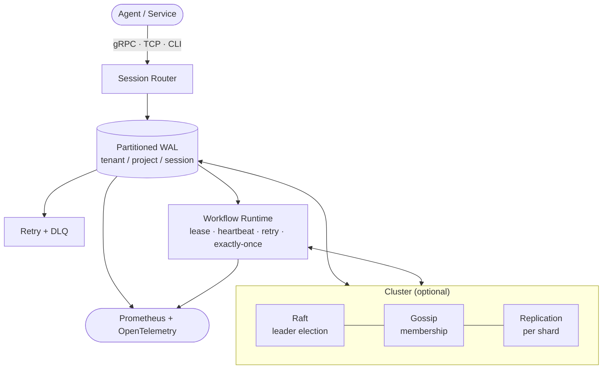

<!--
  Agent Bus - README
  Animated header uses capsule-render + readme-typing-svg (public services).
-->

<div align="center">


<br />

<a href="https://github.com/khangpt2k6/AgentBus/releases">
  
</a>

<p>
  <a href="https://github.com/khangpt2k6/AgentBus/releases">
    
  </a>
  
  
  
  
</p>

<p>
  <a href="#why-agentbus"><b>Why AgentBus</b></a> ·
  <a href="visualization/index.html"><b>🖥️ Interactive architecture</b></a> ·
  <a href="#quick-start"><b>Quick start</b></a> ·
  <a href="https://khangpt2k6.github.io/AgentBus/"><b>📖 Documentation</b></a>
</p>

</div>

A **distributed event log and workflow execution runtime for AI agents**, written from scratch in Go. Ordered per-session streams, durable task execution, and Raft-replicated failover, all in one binary.

> Not a Kafka replacement. Focused on AI-native streaming where ordering, replay, and low operational overhead matter.


## Why AgentBus

AI-agent traffic is a shape most brokers were not built for: many concurrent per-session streams that must stay in order, replay from any offset, and back a task (a tool call) that can run for minutes, retry, or need a heartbeat. Off-the-shelf options each cover half of that:

- A log broker (**Kafka**, Kinesis) gives ordering and replay, but nothing for leasing a task to a worker, retrying it, or fencing a duplicate completion.
- A job queue (**Celery**, SQS) gives task execution, but no ordered per-session log to replay or audit against.
- Both assume an ops team; a single agent pipeline usually gets neither and ends up gluing the two together by hand.

AgentBus is both halves in one small Go binary: a partitioned, replayable event log for agent/session traffic, and a **workflow runtime** (submit, lease, heartbeat, retry, exactly-once completion) built directly on that log. The distributed internals - **Raft** metadata consensus, **gossip** membership, per-shard replication, **group-commit WAL** - are implemented directly rather than delegated to Kafka or etcd, so the whole failure-and-recovery path stays in one small repo instead of a stack of managed services.

## Engineering highlights

- **Session-ordered event log** - every `tenant/project/session` routes to a stable partition, so a producer's events stay in order and can replay from any offset.
- **Durable workflow execution** - submit, lease, heartbeat, retry, and exactly-once completion, event-sourced on that same log. A restarted broker replays back to the same state instead of trusting an in-memory snapshot.
- **Group-commit WAL** - every write is fsynced before it's acknowledged, batched so durability doesn't come at the cost of one fsync per write.
- **Raft + gossip cluster** - optional multi-node mode: **Raft** handles leader election and metadata, **SWIM gossip** tracks membership, and every shard replicates to all live nodes. A node can die without losing committed data or needing a human to step in.
- **Agent-native isolation** - broker-side retry/DLQ past max attempts, plus per-tenant rate limits so one noisy agent can't starve another.
- **Dual API** - gRPC and raw TCP, plus a CLI. Cluster-mode leader redirects are transparent to the SDK.
- **Observability out of the box** - Prometheus metrics and OpenTelemetry traces, session-grouped, with ready-made Grafana dashboards.

## Architecture


```mermaid
flowchart TB
    Agent(["Agent / Service"]) -->|"gRPC · TCP · CLI"| Router["Session Router"]
    Router --> Log[("Partitioned WAL<br/>tenant / project / session")]
    Log --> DLQ["Retry + DLQ"]
    Log --> Workflow["Workflow Runtime<br/>lease · heartbeat · retry · exactly-once"]

    subgraph Cluster["Cluster (optional)"]
        direction LR
        Raft["Raft<br/>leader election"] --- Gossip["Gossip<br/>membership"] --- Repl["Replication<br/>per shard"]
    end

    Log <--> Cluster
    Workflow <--> Cluster

    Log --> Obs(["Prometheus + OpenTelemetry"])
    Workflow --> Obs
```

Full design notes and an animated walkthrough live in the [documentation](https://khangpt2k6.github.io/AgentBus/) and [`visualization/index.html`](visualization/index.html).

## Quick start

```bash
# Install (Linux / macOS)
curl -sSfL https://raw.githubusercontent.com/khangpt2k6/AgentBus/main/install.sh | sh

# Run the broker
broker --tcp-addr=:9090 --grpc-addr=:9095 --metrics-addr=:2112 --wal-path=data/agentbus.wal

# Publish + consume
goqueue publish --grpc --addr localhost:9095 --topic orders "hello"
goqueue consume --grpc --addr localhost:9095 --topic orders --group payment-service --partition -1

# Durable workflow execution
goqueue workflow submit --tenant acme --project etl --id job-1 --task-type transform --input '{"rows":100}'
goqueue workflow status --tenant acme --project etl --id job-1
goqueue workflow history --tenant acme --project etl --id job-1   # deterministic replay of state transitions
```

Docker, Helm, the Go SDK, cluster mode, and session replay are all covered in the docs:

- **[Installation](https://khangpt2k6.github.io/AgentBus/getting-started/)** · binaries, Docker, Helm, source
- **[Integrate the Go SDK](https://khangpt2k6.github.io/AgentBus/integrate/)** · publish agent events from your app
- **[Concepts](https://khangpt2k6.github.io/AgentBus/concepts/sessions/)** · sessions & ordering, retry/DLQ, WAL & replay
- **[Deploy](https://khangpt2k6.github.io/AgentBus/deploy/docker/)** · Docker, Kubernetes, systemd
- **[Observability](https://khangpt2k6.github.io/AgentBus/observability/)** · metrics, traces, dashboards
- **[CLI reference](https://khangpt2k6.github.io/AgentBus/reference/cli/)** · every command and flag

---

<div align="center">

<sub>Pure-Go distributed broker · Raft · WAL · gRPC · OpenTelemetry · MIT licensed</sub>
<br />
<sub><a href="https://github.com/khangpt2k6/AgentBus/issues">Issues</a> · <a href="https://github.com/khangpt2k6/AgentBus/releases">Releases</a> · <a href="https://khangpt2k6.github.io/AgentBus/">Docs</a></sub>

<br /><br />


</div>
