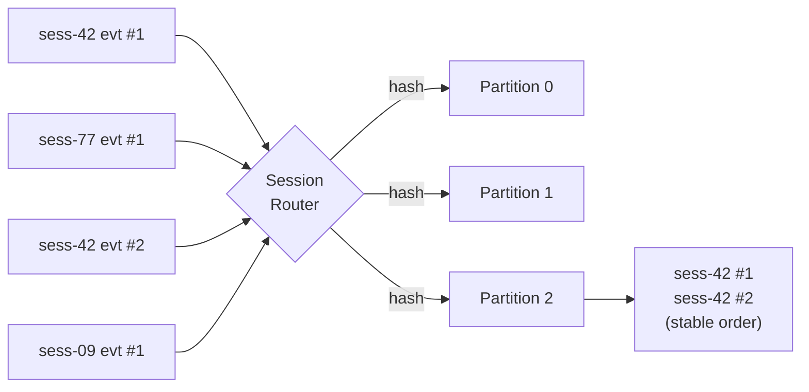

# Sessions & Ordering

## The problem

A multi-agent AI run produces a bursty stream of events for a single conversation: token chunks, tool calls, retries, handoffs. If two events for the **same conversation** land on different consumers or arrive out of order, downstream state breaks — tool calls execute before their context arrives, replays look corrupted, debugging becomes guesswork.

A flat queue can't fix this. A naive sharded queue makes it worse.

## The model

Every agent event carries a triple:

```
tenant   /  project       /  session
acme     /  support-bot   /  sess-42
```

The broker hashes that triple to pick a **partition**. Same triple, same partition — forever. Within a partition, order is strictly preserved.



## Why this triple

| Level | Why it's in the key |
|---|---|
| `tenant` | multi-tenant isolation — one customer's traffic never collides with another's in the same partition |
| `project` | a tenant can run multiple agent products (support bot, sales bot) without one starving the other |
| `session` | per-conversation ordering — the actual unit users care about |

You can publish ordinary topic messages too (no triple required); they're routed by topic + key like a normal queue. The session-ordered path is opt-in via `publish-agent` and the gRPC `PublishAgent` RPC.

## What you can rely on

- Events for the same `tenant/project/session` are delivered in the order they were accepted by the broker.
- A single consumer in a group sees one partition's events serially.
- Across partitions, order is **not** preserved — and shouldn't matter, because by definition those are different sessions.

## What this does not give you

- **Global ordering across sessions.** This is intentional — global ordering doesn't compose with horizontal scaling.
- **Exactly-once delivery.** Consumers should be idempotent on `(session_id, attempt)` or whatever natural key your event carries.
- **Cross-partition transactions.** Out of scope.

## Try it

```bash
# Two events for the same session — guaranteed in order
goqueue publish-agent --grpc --addr localhost:9095 \
  --tenant acme --project bot --session sess-42 --agent planner \
  --type tool.call --attempt 1 --payload '{"step":"a"}'

goqueue publish-agent --grpc --addr localhost:9095 \
  --tenant acme --project bot --session sess-42 --agent planner \
  --type tool.call --attempt 1 --payload '{"step":"b"}'

# A third event on a different session — may land on any partition
goqueue publish-agent --grpc --addr localhost:9095 \
  --tenant acme --project bot --session sess-99 --agent planner \
  --type tool.call --attempt 1 --payload '{"step":"x"}'
```

Consume with `--partition -1` to read from all partitions; the `sess-42` pair will always appear in `a → b` order on whichever lane they were assigned.
