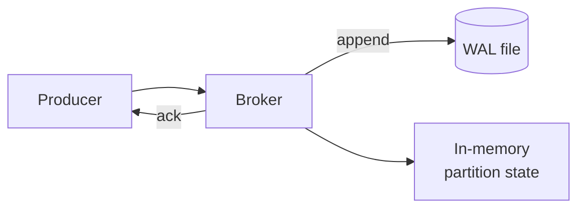
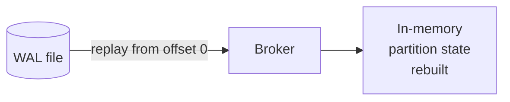

# WAL & Replay

Agent Bus persists every accepted event to an append-only **Write-Ahead Log** before acknowledging the producer. When the broker restarts — planned or after a crash — it replays the WAL to rebuild its in-memory state.

## Why this matters

In-memory queues are fast but forget on restart. Full databases are durable but expensive to operate. A WAL is the middle ground: one append per write, fast to replay, no external service to babysit.

## Lifecycle



On restart:



## What's stored

Each WAL entry contains enough to reconstruct the event: topic, partition assignment, offset, key, payload, and metadata. The exact wire format lives in `internal/wal/`.

## Operational knobs

- `--wal-path` — file location. Use a path on persistent storage (not `/tmp`).
- WAL is append-only; size grows with traffic. Eviction is tracked per partition based on consumer offsets — see the broker source for current GC behavior.

## What this does **not** give you

- **Replication.** A single WAL file lives on a single disk. Lose the disk, lose the log. The path to replicated durability is described in [Distributed v1](../distributed-v1-design.md).
- **Point-in-time queries.** The WAL is a recovery log, not a query store. Send a copy to your data warehouse if you need ad-hoc analytics on event history.

## Verifying replay locally

```bash
# 1. Start broker with a WAL path
broker --tcp-addr=:9090 --wal-path=./data/agentbus.wal

# 2. Publish some events
goqueue publish --addr localhost:9090 --topic orders "msg-1"
goqueue publish --addr localhost:9090 --topic orders "msg-2"

# 3. Kill the broker (Ctrl-C) and start it again with the same --wal-path
# 4. Consume — you should see msg-1 and msg-2 replayed
goqueue consume --addr localhost:9090 --topic orders --group demo
```
