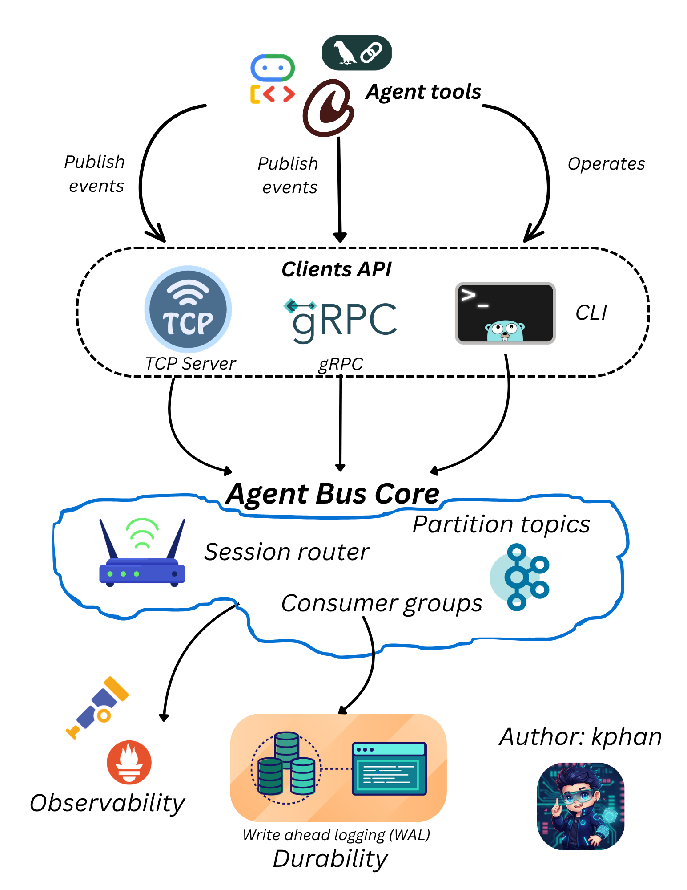

---
hide:
  - navigation
  - toc
---

<div class="ab-hero" markdown>

<span class="ab-eyebrow">:material-circle-medium: v0.4.0 now available</span>

# Session-ordered event bus, built for AI agents.

<p class="ab-lede">
AgentBus is the open-source event bus your multi-agent systems were waiting for. Stable per-session ordering, crash-safe WAL, built-in replay, OpenTelemetry traces, and HTTP webhook fan-out — in a single Go binary.
</p>

<div class="ab-cta">
  <a href="getting-started/" class="primary">Get started in 60 seconds &nbsp;→</a>
  <a href="https://github.com/khangpt2k6/AgentBus" class="ghost" target="_blank" rel="noopener">:fontawesome-brands-github: View on GitHub</a>
</div>

<ul class="ab-pills">
  <li><span class="dot"></span> Single Go binary</li>
  <li><span class="dot"></span> Docker image on GHCR</li>
  <li><span class="dot"></span> No Zookeeper / no Raft to babysit</li>
  <li><span class="dot"></span> MIT licensed</li>
</ul>

</div>

## 60-second tour

=== "1 · Install"

    ```bash
    # Linux / macOS
    curl -sSfL https://raw.githubusercontent.com/khangpt2k6/AgentBus/main/install.sh | sh

    # or Docker
    docker run -d -p 9095:9095 ghcr.io/khangpt2k6/goqueue:latest --grpc-addr=:9095

    # or Kubernetes (Helm)
    helm install agentbus oci://ghcr.io/khangpt2k6/charts/agentbus

    # or in your Go module
    go get github.com/khangpt2k6/AgentBus/agentbus@latest
    ```

=== "2 · Publish a session event"

    ```go
    import "github.com/khangpt2k6/AgentBus/agentbus"

    client, _ := agentbus.Connect(ctx, "localhost:9095")
    defer client.Close()

    client.PublishToolCall(ctx, agentbus.SessionRef{
        Tenant:    "acme",
        Project:   "support-bot",
        SessionID: "sess-42",
        AgentID:   "planner",
    }, agentbus.ToolCall{
        Tool:      "search",
        Arguments: []byte(`{"query":"latest order"}`),
    })
    ```

=== "3 · Replay the whole run later"

    ```bash
    goqueue session replay --grpc --addr localhost:9095 \
      --tenant acme --project support-bot --session sess-42
    ```

    Output: every event for the session, in order. Tool calls, retries, handoffs, completions — the whole story.

---

## Why people pick AgentBus

<div class="grid cards" markdown>

-   :material-clock-fast:{ .lg .middle } &nbsp; **Per-session ordering, by default**

    ---

    Hash routes by `tenant/project/session`. Same session always lands on the same partition, so its events stay in order — without distributed locks or 2PC.

    [:octicons-arrow-right-24: Sessions & ordering](concepts/sessions.md)

-   :material-history:{ .lg .middle } &nbsp; **Session replay, built-in**

    ---

    Got a session id? Get the full trace. `goqueue session replay` or `client.ReplaySession` returns every event chronologically — self-hosted alternative to LangSmith-style traces.

    [:octicons-arrow-right-24: Debug an agent run](debug-agent-run.md)

-   :material-database-refresh:{ .lg .middle } &nbsp; **Crash-safe WAL with CRC32C**

    ---

    Append-only log with group-commit fsync, payload bounds, and `WAL-first` publish ordering. Lose power, replay on restart, no surprises.

    [:octicons-arrow-right-24: WAL & replay](concepts/wal-replay.md)

-   :material-chart-bell-curve:{ .lg .middle } &nbsp; **OpenTelemetry, zero glue**

    ---

    Broker auto-tags every Publish span with `agent.session.id`. Search by session in Jaeger / Tempo without instrumenting your agent.

    [:octicons-arrow-right-24: OpenTelemetry tracing](otel-tracing.md)

-   :material-webhook:{ .lg .middle } &nbsp; **Webhook fan-out for non-Go consumers**

    ---

    `goqueue webhook --url ...` POSTs every event to any HTTPS endpoint with retry, backoff, and standard tagging headers. Slack, PagerDuty, Lambda — all bridgeable.

    [:octicons-arrow-right-24: Webhook subscriber](webhook.md)

-   :material-package-variant-closed:{ .lg .middle } &nbsp; **Operates like a small thing**

    ---

    Single Go binary, optional Docker Compose for the observability stack, no consensus daemon to babysit. Run it on a VM, in Kubernetes, or alongside your app.

    [:octicons-arrow-right-24: Deploy on Docker](deploy/docker.md)

</div>

---

## How it fits together

{ loading=lazy }

| Layer | Responsibility |
|---|---|
| **Client APIs** | TCP, gRPC, CLI, and Go SDK surfaces for producers and consumers |
| **Session router** | Picks a partition per `tenant/project/session` to keep per-session ordering stable |
| **Partitioned topics** | Append-only ring buffers with offset and eviction tracking |
| **Retry + DLQ** | Broker-native policy that auto-routes failed events on max-attempts |
| **WAL** | Append-only durability with CRC32C and full replay on restart |
| **Observability** | Prometheus counters, OTEL traces with session-derived trace IDs, Grafana + WASM dashboards |

---

## When to use it

!!! tip "Good fit"
    - Multi-agent AI workflows that need per-conversation event ordering
    - You want session-level replay for debugging without paying a hosted observability vendor
    - Single-node or small-cluster deployment is fine; you don't need 9-nines availability
    - You prefer self-hosting and a small binary over running a Kafka stack

!!! warning "Not a fit (yet)"
    - You need real distributed consensus across nodes (see [distributed-v1](distributed-v1-design.md) design notes)
    - Your workload is millions of messages per second per partition (it's fast, but not Kafka-fast)
    - You require hard exactly-once semantics across consumers

---

## Where to go next

<div class="grid cards" markdown>

-   [:material-rocket-launch: **Get started**](getting-started.md)

    Install, run a broker, send your first event in 60 seconds.

-   [:material-code-tags: **Integrate the Go SDK**](integrate.md)

    Add `agentbus.Connect` to your app, build typed agent events.

-   [:material-bug: **Debug an agent run**](debug-agent-run.md)

    The killer-feature workflow — session id in, full trace out.

-   [:material-source-branch: **GitHub**](https://github.com/khangpt2k6/AgentBus)

    Read the source, file issues, star if you like it.

</div>

<p style="text-align: center; color: var(--ab-text-muted); font-size: 0.78rem; margin-top: 3rem;">
Built in Go &nbsp;·&nbsp; MIT licensed &nbsp;·&nbsp; <a href="https://github.com/khangpt2k6/AgentBus/releases" rel="noopener">Latest release</a>
</p>
