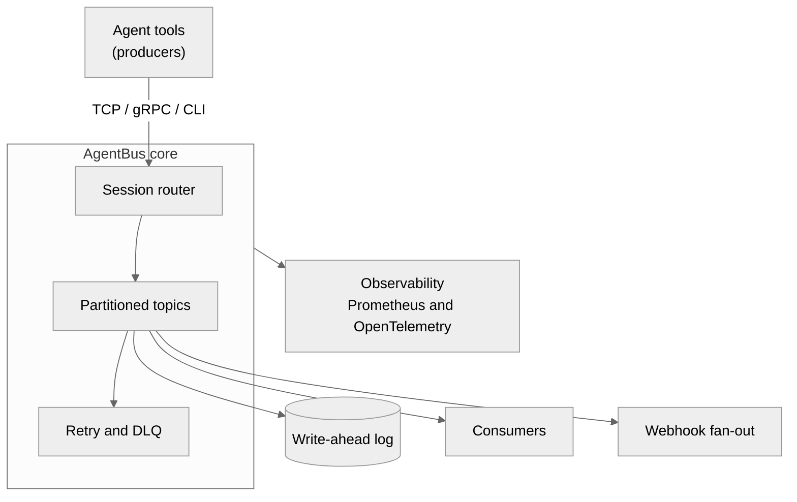

---
hide:
  - navigation
  - toc
---

<div class="ab-hero" markdown>

<span class="ab-eyebrow">:material-circle-medium: v0.5.0 now available</span>

# A session-ordered event bus for AI agents

<p class="ab-lede">
AgentBus is an open-source event bus for multi-agent AI systems. It keeps every session in order, stores each event in a crash-safe write-ahead log, and lets you replay a full run at any time. OpenTelemetry traces and HTTP webhook fan-out are built in. Everything ships as a single Go binary.
</p>

<div class="ab-cta">
  <a href="getting-started/" class="primary">Get started in 60 seconds &nbsp;→</a>
  <a href="https://github.com/khangpt2k6/AgentBus" class="ghost" target="_blank" rel="noopener">:fontawesome-brands-github: View on GitHub</a>
</div>

<ul class="ab-pills">
  <li><span class="dot"></span> Single Go binary</li>
  <li><span class="dot"></span> Docker image on GHCR</li>
  <li><span class="dot"></span> No Zookeeper or Raft to operate</li>
  <li><span class="dot"></span> MIT licensed</li>
</ul>

</div>

## 60-second tour

=== "1 · Install"

    ```bash
    # Linux / macOS
    curl -sSfL https://raw.githubusercontent.com/khangpt2k6/AgentBus/main/install.sh | sh

    # or Docker
    docker run -d -p 9095:9095 ghcr.io/khangpt2k6/goqueue:latest --grpc-addr=:9095

    # or Kubernetes (Helm)
    helm install agentbus oci://ghcr.io/khangpt2k6/charts/agentbus

    # or in your Go module
    go get github.com/khangpt2k6/AgentBus/agentbus@latest
    ```

=== "2 · Publish a session event"

    ```go
    import "github.com/khangpt2k6/AgentBus/agentbus"

    client, _ := agentbus.Connect(ctx, "localhost:9095")
    defer client.Close()

    client.PublishToolCall(ctx, agentbus.SessionRef{
        Tenant:    "acme",
        Project:   "support-bot",
        SessionID: "sess-42",
        AgentID:   "planner",
    }, agentbus.ToolCall{
        Tool:      "search",
        Arguments: []byte(`{"query":"latest order"}`),
    })
    ```

=== "3 · Replay the whole run later"

    ```bash
    goqueue session replay --grpc --addr localhost:9095 \
      --tenant acme --project support-bot --session sess-42
    ```

    The output is every event for that session, in the order it happened: tool calls, retries, handoffs, and completions.

---

## What AgentBus gives you

<div class="grid cards" markdown>

-   :material-clock-fast:{ .lg .middle } &nbsp; **Per-session ordering by default**

    ---

    AgentBus hashes the `tenant/project/session` key to choose a partition. The same session always lands on the same partition, so its events stay in order. No distributed locks or two-phase commit are required.

    [:octicons-arrow-right-24: Sessions and ordering](concepts/sessions.md)

-   :material-history:{ .lg .middle } &nbsp; **Built-in session replay**

    ---

    Give AgentBus a session id and it returns the full trace. `goqueue session replay` and `client.ReplaySession` return every event in order. It is a self-hosted alternative to a hosted tracing product.

    [:octicons-arrow-right-24: WAL and replay](concepts/wal-replay.md)

-   :material-database-refresh:{ .lg .middle } &nbsp; **Crash-safe write-ahead log**

    ---

    Every event is written to an append-only log with CRC32C checksums and group-commit fsync before it is acknowledged. If the broker loses power, it replays the log on restart.

    [:octicons-arrow-right-24: WAL and replay](concepts/wal-replay.md)

-   :material-chart-bell-curve:{ .lg .middle } &nbsp; **OpenTelemetry with no extra wiring**

    ---

    The broker tags every publish span with `agent.session.id`. You can search by session in Jaeger or Tempo without adding any instrumentation to your agent.

    [:octicons-arrow-right-24: OpenTelemetry tracing](otel-tracing.md)

-   :material-webhook:{ .lg .middle } &nbsp; **Webhook fan-out for any consumer**

    ---

    `goqueue webhook --url ...` posts every event to any HTTPS endpoint with retries, backoff, and standard tagging headers. This connects AgentBus to Slack, PagerDuty, Lambda, and similar services.

    [:octicons-arrow-right-24: Webhook subscriber](webhook.md)

-   :material-package-variant-closed:{ .lg .middle } &nbsp; **Simple to operate**

    ---

    AgentBus is a single Go binary. Docker Compose is optional and only needed for the observability stack. There is no consensus daemon to manage. Run it on a VM, in Kubernetes, or next to your app.

    [:octicons-arrow-right-24: Deploy on Docker](deploy/docker.md)

</div>

---

## How it fits together


```mermaid
%%{init: {"theme": "neutral"}}%%
flowchart TB
    P["Agent tools<br/>(producers)"] -->|TCP / gRPC / CLI| R
    subgraph CORE["AgentBus core"]
        direction TB
        R["Session router"] --> T["Partitioned topics"]
        T --> RD["Retry and DLQ"]
    end
    T --> W[("Write-ahead log")]
    T --> C["Consumers"]
    T --> H["Webhook fan-out"]
    CORE --> O["Observability<br/>Prometheus and OpenTelemetry"]
```

| Layer | Responsibility |
|---|---|
| **Client APIs** | TCP, gRPC, CLI, and Go SDK surfaces for producers and consumers |
| **Session router** | Picks a partition per `tenant/project/session` to keep per-session ordering stable |
| **Partitioned topics** | Append-only ring buffers with offset and eviction tracking |
| **Retry + DLQ** | Broker-native policy that auto-routes failed events on max-attempts |
| **WAL** | Append-only durability with CRC32C and full replay on restart |
| **Observability** | Prometheus counters, OTEL traces with session-derived trace IDs, Grafana + WASM dashboards |

---

## When to use it

!!! tip "Good fit"
    - Multi-agent AI workflows that need per-conversation event ordering
    - You want to replay a session for debugging without paying for a hosted observability product
    - A single-node or small-cluster deployment is enough; you do not need extreme availability
    - You prefer to self-host a small binary instead of running a full Kafka stack

!!! warning "Not a fit yet"
    - You need full distributed consensus across many nodes. Cluster mode is still in alpha and multi-node replication is maturing.
    - Your workload is millions of messages per second on a single partition. AgentBus is fast, but it is not built for Kafka-scale throughput.
    - You require strict exactly-once delivery across consumers.

---

## Where to go next

<div class="grid cards" markdown>

-   [:material-rocket-launch: **Get started**](getting-started.md)

    Install, run a broker, send your first event in 60 seconds.

-   [:material-code-tags: **Integrate the Go SDK**](integrate.md)

    Add `agentbus.Connect` to your app, build typed agent events.

-   [:material-bug: **Replay a session**](concepts/wal-replay.md)

    The core workflow: give it a session id, get the full trace back.

-   [:material-source-branch: **GitHub**](https://github.com/khangpt2k6/AgentBus)

    Read the source, file issues, star if you like it.

</div>

<p style="text-align: center; color: var(--ab-text-muted); font-size: 0.78rem; margin-top: 3rem;">
Built in Go &nbsp;·&nbsp; MIT licensed &nbsp;·&nbsp; <a href="https://github.com/khangpt2k6/AgentBus/releases" rel="noopener">Latest release</a>
</p>
